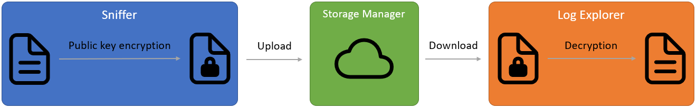

# SDC Data Safe

## Introduction
ISO/IEEE 11073 service-oriented device connectivity (SDC) is a new standard for manufacturer-independent medical device-to-device interoperability. To analyse the workflow and track errors during patient treatment, it is important to securely protect the data from tampering, deletion and access by unauthorized third parties. This project uses an eco-friendly blockchain technology and public key encryption to handle the security concerns.

The whole project **SDC Blockchain Logger** is open source and consists of three applications for different tasks:
- [**SDC Log Explorer**](https://github.com/KevinTuncer/sdc-log-explorer) to display, filter and browse through the log.
- [**SDC Sniffer**](https://github.com/KevinTuncer/sdc-sniffer) to sniff SDC messages between medical devices. 
- [**SDC Data Safe**](https://github.com/KevinTuncer/sdc-data-safe) to handle permissions and storage on blockchain.

## Data Safe
This application is a smart contract to manage permissions and storage on blockchain.

## Setup
### One example to setup a blockchain with this contract:
1. Install [Docker](https://www.docker.com/).
2. Install [EOS Studio](https://www.eosstudio.io/).

In EOS Studio

3. Install EOSIO and EOSIO.CDT with EOS Studio.
4. Create a local blockchain, start it and create accounts for the contract, a scope and two users.
5. Open this project Data Safe, compile it and deploy it to the contract account.
6. Select the scope account and open the deployed contract of this account. There select the action **permission**.
7. Add a user with **storing** permission by entering the scope name, the user name, _true_ for storing and _false_ for reading in the corresponding inputs.
8. Add another user with **reading** permission. Therefore enter _false_ for storing and _true_ for reading.
9. Select the action **setreadkey** enter the scope name, user name and a **public PGP key** of this user. 
_The user can upload a public key by himself, but then the scope account have to verify it by sending the **setreadkey** with empty readpublickey input_

Finished

10. Now you can add the applied parameters for the Sniffer and Log Explorer. _The sniffer needs an user account with storing permission and the Log Explorer can be used with an user account with reading permission._

## Implementation

### Blockchain
Data Safe can be executed on EOSIO blockchains. This type of blockchain can run as a private, consortium or decentralized blockchain. EOSIO uses delegated proof of stack (sPoS), an eco-friendly and fast alternative to proof of work (PoW). DPoS is usually considered more centralized than PoW, but in medical technology this could be an advantage. By distribution of tokens, certain institutions or authorities for regulation can granted more voting power in the network.
An overview of the components for handling EOSIO blockchains can be seen in the picture.

### Grouping
The grouping is shown in the following picture. Data Safe is a Contract that runs on a blockchain. By using different contract names, a blockchain can provide several Data Safe contracts. Each Data Safe contract provide several scopes. Each scope can handle several users. Contract, scope and user are defined by EOSIO account names.

For example: A hospital association runs a private blockchain and uses the contract name _datasafe_. Each hospital in this association has an own scope like _ac.hospital1_, _ac.hospital2_ etc. 
Each running sniffer has its own user account. If there is only one sniffer for each operating room they may be called _op.room1_, _op.room2_ etc.

## Storing method
The data content is uploaded to the blockchain by transactions. In addition to the chaining of blocks, the transactions have an internal chaining, too. Each new transaction refers to the last transaction by this user with the same scope and contract. EOSIO blockchains have the blockchain resource EOSIO RAM for fast queries. The last transaction with its reference is saved in this RAM. An illustration is shown in the picture and see SavAct's SavWeb which uses a similar storing method for decentralised websites on blockchain.

# Licence
The whole project is open source and free to use, see MIT licence. If you want to work on this project, feel free to contact me or push some improvements.